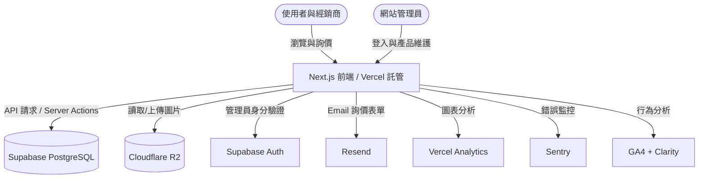
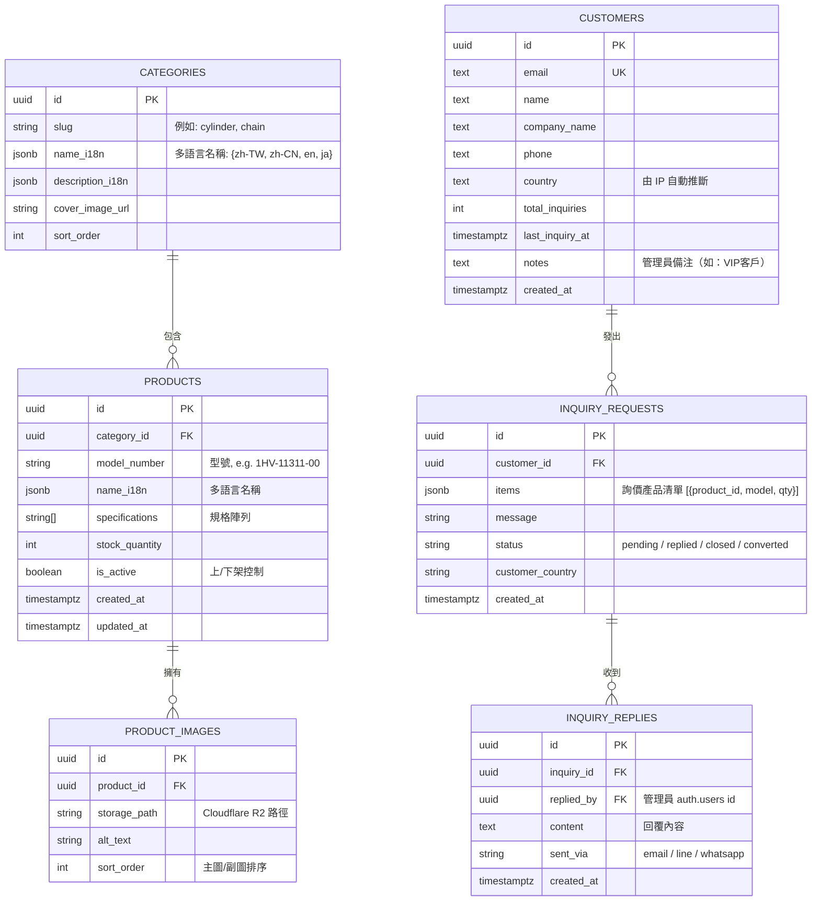

# 摩托車零件網站現代化重構計畫 (Modernization & Refactoring Plan)

> **版本**：v1.4（補充 SEO hreflang／robots.txt、Security Headers、資料庫擴充、維運監控、商業頁面、無障礙、CI/CD、環境變數清單、里程碑時間軸）
> **目前初版測試網址**：https://jajanuj.github.io/motorcyclepartweb/  
> **計畫狀態**：等待確認後執行

### 版本更新紀錄

| 版本 | 主要更新內容 |
| :--- | :--- |
| v1.0 | 初版技術選型與功能規劃 |
| v1.1 | 補充多語言 i18n、圖片優化策略 |
| v1.2 | 補充資料庫 Schema、專案目錄結構 |
| v1.3 | 補充資安防護（CAPTCHA/Rate Limiting）、分析工具、CRM 評估 |
| **v1.4** | **補充 hreflang／robots.txt／Canonical URL、Next.js Security Headers、資料庫擴充（CUSTOMERS / INQUIRY_REPLIES / Index）、Sentry 錯誤監控、UptimeRobot、商業頁面（About／聯絡／隱私政策）、Cookie Banner、產品 Permalink、Breadcrumb、無障礙規範、列印樣式、CI/CD PR Gate、完整 .env.example、里程碑時間軸、日文市場評估** |

作為資深網頁全端工程師，針對目前網站（初版託管於 GitHub Pages）的重構與架構升級，以下為您規劃目前業界最主流、高效且符合未來的技術架構方案。

---

## 1. 專案目標與受眾 (Goal & Audience)

*   **核心目標**：建立一個現代化、高效能、易於維護的**摩托車零組件線上產品目錄系統**。
*   **目標受眾**：
    *   **潛在買家/車行/經銷商**：能快速檢索產品型號、查看高畫質細節照片、查詢產品規格，並能輕鬆發起詢價。
    *   **網站管理者 (商戶)**：能透過直覺的安全後台，直接新增、刪除、修改產品，且能直接在網頁上傳圖片，不再需要撰寫程式碼或操作 Git。

---

## 2. 主流技術規格與架構評估 (Technology Stack)

為了在**維持「零託管費用」**的前題下實現動態產品管理與後台登入，推薦使用以下 **Serverless Full-stack** 架構：



### 技術棧明細：

| 分層 | 技術選擇 | 版本 | 用途說明 |
| :--- | :--- | :--- | :--- |
| **前端框架** | Next.js + React + TypeScript | 15 (App Router) | 全站 SSG/SSR 渲染、路由管理 |
| **樣式系統** | Tailwind CSS | v3.x | RWD、深色模式、快速客製化 |
| **微動畫** | Framer Motion | v11 | 卡片動畫、頁面切換過場 |
| **UI 組件庫** | shadcn/ui | 最新版 | 表單、Modal、Toast 等現成組件 |
| **資料庫** | Supabase (PostgreSQL) | 免費版 | 產品資料 CRUD |
| **圖片儲存** | **Cloudflare R2** ✅ 直接採用 | 免費 10GB | 產品照片上傳管理 + 全球 CDN |
| **身分驗證** | Supabase Auth | — | 管理員安全登入 |
| **多語言 i18n** | next-intl | v3 | 三語言路由與文字管理 |
| **圖片優化** | Next.js Image | 內建 | 自動 WebP 轉換、Lazy Load |
| **表單驗證** | React Hook Form + Zod | 最新版 | 後台產品新增表單驗證 |
| **Email 服務** | Resend (免費版 3000封/月) | — | 詢價信件自動發送 |
| **程式碼品質** | ESLint + Prettier | — | 統一程式碼格式 |
| **錯誤監控** | **Sentry** ✅ 新增 | 免費版 | 前後端錯誤自動捕獲與通知 |
| **Uptime 監控** | **UptimeRobot** ✅ 新增 | 免費版 | 網站下線 5 分鐘內 Email 通知 |

> [!NOTE]
> **補充說明 - 為何選用 shadcn/ui？**
> shadcn/ui 是目前 Next.js 生態中最主流的 UI 組件庫，它不是一個依賴包，而是可以直接複製原始碼到您的專案中的組件集合。這表示您可以自由客製化每一個按鈕、彈窗樣式，完全掌控程式碼，不會被第三方組件庫綁死。

---

## 3. 核心功能需求 (Core Features)

### 【功能一：權限驗證與後端管理系統 (Admin Portal)】
*   **管理員登入**：安全的身分驗證頁面，僅限授權帳號進入（路由 `/admin` 自動守衛）。
*   **產品看板 (Dashboard)**：
    *   **新增產品**：輸入型號、名稱、規格（如 STD、47mm，支援標籤式輸入）、庫存，並可**直接拖放上傳圖片**。
    *   **修改/編輯**：即時修改產品資訊與上下架狀態。
    *   **刪除產品**：一鍵下架或刪除（含確認提示）。
    *   **批量上傳**：支援 CSV 或 Excel 匯入多筆產品資料（一次建立整個品項分類）。

### 【功能二：訪客產品目錄與高效搜尋】
*   **動態產品列表**：依照類別（汽缸、鏈條、離合器等）自動分類，支援無縫分頁。
*   **多維度搜尋/篩選**：支援品名、型號、規格（標籤）的模糊比對與即時過濾（即打即搜）。
*   **產品詳細頁 (Permalink)**：每個產品有獨立 URL（`/products/cylinder/1HV-11311-00`），可直接分享給客戶，且能被 Google 索引（見功能七詳細說明）。
*   **一鍵詢價功能**：生成預填產品型號與名稱的聯絡表單，整合 Email（透過 Resend）或 LINE / WhatsApp 快速發送。

### 【功能三：SEO 與效能優化】

*   **每頁獨立的 Meta 資訊**：每個產品分類頁面有獨立的 `<title>`、`<meta description>`，提升 Google 搜尋排名。
*   **Open Graph (OG) 圖片**：分享到 LINE / Facebook 時自動顯示產品圖片預覽卡片。
*   **結構化資料 (Schema.org)**：為每個產品加入 JSON-LD 結構化標記（Product Schema），讓 Google 搜尋結果直接顯示零件型號、庫存狀態。
*   **XML Sitemap 自動生成**：每次新增產品時，自動更新網站地圖，加速 Google 索引。
*   **hreflang 多語言 SEO 標籤** ✅ 新增：三語言網站必做，告知 Google 各語言版本的對應關係，避免被當作重複內容降排名（見下方實作）。
*   **robots.txt 設定** ✅ 新增：禁止爬蟲進入 `/admin` 路徑，避免管理後台頁面出現在搜尋結果中。
*   **Canonical URL 策略** ✅ 新增：避免多語言頁面造成重複內容懲罰。

#### hreflang 標籤實作（多語言 SEO 必做）

在 `src/app/[locale]/layout.tsx` 加入，讓 Google 正確識別各語言版本：

```typescript
// src/app/[locale]/layout.tsx
export async function generateMetadata({ params }: { params: { locale: string } }) {
  const baseUrl = 'https://motoparts-taiwan.com'
  const currentPath = '/products' // 根據實際路由動態產生

  return {
    alternates: {
      canonical: `${baseUrl}/${params.locale}${currentPath}`,
      languages: {
        'zh-TW':     `${baseUrl}/zh-TW${currentPath}`,
        'zh-CN':     `${baseUrl}/zh-CN${currentPath}`,
        'en':        `${baseUrl}/en${currentPath}`,
        'x-default': `${baseUrl}/en${currentPath}`, // 語言不匹配時的預設版本
      },
    },
  }
}
```

**產生的 HTML**：
```html
<link rel="canonical"              href="https://motoparts-taiwan.com/zh-TW/products" />
<link rel="alternate" hreflang="zh-TW" href="https://motoparts-taiwan.com/zh-TW/products" />
<link rel="alternate" hreflang="zh-CN" href="https://motoparts-taiwan.com/zh-CN/products" />
<link rel="alternate" hreflang="en"    href="https://motoparts-taiwan.com/en/products" />
<link rel="alternate" hreflang="x-default" href="https://motoparts-taiwan.com/en/products" />
```

#### robots.txt 設定

```typescript
// src/app/robots.ts（Next.js 自動生成 /robots.txt）
import type { MetadataRoute } from 'next'

export default function robots(): MetadataRoute.Robots {
  return {
    rules: [
      {
        userAgent: '*',
        allow: '/',
        disallow: [
          '/*/admin/',   // 禁止爬蟲進入管理後台
          '/api/',       // 禁止爬蟲呼叫 API 端點
          '/_next/',     // Next.js 內部路徑
        ],
      },
    ],
    sitemap: 'https://motoparts-taiwan.com/sitemap.xml',
  }
}
```

#### Canonical URL 多語言策略

| 情境 | 正確做法 |
| :--- | :--- |
| `/zh-TW/products/cylinder` | canonical 指向自己；hreflang 指向三個版本 |
| `/zh-CN/products/cylinder` | canonical 指向自己；hreflang 指向三個版本 |
| 分頁（`?page=2`）| canonical 指向第一頁，避免重複內容 |
| 搜尋結果頁 | 加入 `<meta name="robots" content="noindex">` |

---

### 【功能四：詢價流程優化】
*   **詢價單 (RFQ) 購物車**：訪客可以先將感興趣的產品加入「詢價清單」，最後一次性送出所有需求（避免一個產品送一封 Email 的繁瑣流程）。
*   **Email 自動回覆**：客戶送出詢價後，自動發送確認信至客戶信箱，同時通知您（管理者）。

---

### 【功能五：資安防護 — CAPTCHA + Rate Limiting】

> [!CAUTION]
> 詢價表單若缺乏防護，機器人可在幾分鐘內送出數百封垃圾詢價，迅速耗盡 Resend 免費配額（3,000封/月），並讓您的信箱被垃圾訊息淹沒。**這是必須在第一階段就實作的資安功能。**

#### Cloudflare Turnstile vs Google reCAPTCHA v3 比較：

| 項目 | **Cloudflare Turnstile** ✅ 推薦 | Google reCAPTCHA v3 |
| :--- | :--- | :--- |
| **費用** | 完全免費，無配額限制 | 免費，但超過 100 萬次/月需付費 |
| **使用者體驗** | **完全隱形**，用戶無需做任何操作（無勾選框、無圖片辨識） | 隱形驗證，但有時會觸發圖片辨識挑戰 |
| **隱私保護** | 不追蹤用戶行為，符合 GDPR | Google 會收集用戶行為資料 |
| **準確率** | 高，基於 Cloudflare 全球網路判斷 | 高，但誤判率稍高 |
| **整合難度** | 極簡單（Next.js 有官方套件） | 簡單 |
| **CDN 加速** | 天然整合 Cloudflare CDN | 無 |
| **結論** | ⭐ **強烈推薦** | 備選方案 |

#### Cloudflare Turnstile 實作方案：

```typescript
// 1. 安裝套件
// npm install @marsidev/react-turnstile

// 2. 在詢價表單中加入驗證元件
import { Turnstile } from '@marsidev/react-turnstile'

export function InquiryForm() {
  return (
    <form>
      {/* 表單欄位 ... */}
      <Turnstile
        siteKey={process.env.NEXT_PUBLIC_TURNSTILE_SITE_KEY!}
        onSuccess={(token) => setTurnstileToken(token)}
      />
      <button type="submit">送出詢價</button>
    </form>
  )
}

// 3. 在 Next.js API Route (Server Action) 中驗證 token
async function verifyTurnstile(token: string) {
  const response = await fetch(
    'https://challenges.cloudflare.com/turnstile/v0/siteverify',
    {
      method: 'POST',
      body: JSON.stringify({
        secret: process.env.TURNSTILE_SECRET_KEY,
        response: token,
      }),
    }
  )
  const data = await response.json()
  return data.success // true = 人類，false = 機器人
}
```

#### Rate Limiting 實作方案（使用 Upstash Redis）：

```typescript
// 限制同一個 IP 每 10 分鐘最多送出 3 次詢價
import { Ratelimit } from '@upstash/ratelimit'
import { Redis } from '@upstash/redis'

const ratelimit = new Ratelimit({
  redis: Redis.fromEnv(),
  limiter: Ratelimit.slidingWindow(3, '10 m'), // 10分鐘內最多3次
})

export async function POST(request: Request) {
  const ip = request.headers.get('x-forwarded-for') ?? '127.0.0.1'
  const { success } = await ratelimit.limit(ip)

  if (!success) {
    return Response.json(
      { error: '請求過於頻繁，請稍後再試' },
      { status: 429 }
    )
  }
  // 繼續處理詢價邏輯...
}
```

> **Upstash Redis 免費版**：每日 10,000 次請求，對小型 B2B 網站完全足夠，費用 $0/月。

---

### 【功能六：HTTP Security Headers（新增）】

> [!CAUTION]
> 原計畫在應用層防護（CAPTCHA + Rate Limiting）上已完善，但遺漏了 HTTP 標頭層級的防護。這是最基本的伺服器資安設定，**加入僅需修改 `next.config.ts` 一個檔案，但能防禦 Clickjacking、MIME 嗅探、跨站腳本等常見攻擊**。

```typescript
// next.config.ts
const securityHeaders = [
  { key: 'X-Frame-Options',        value: 'DENY' },                    // 防 Clickjacking
  { key: 'X-Content-Type-Options', value: 'nosniff' },                  // 防 MIME 嗅探
  { key: 'Referrer-Policy',        value: 'strict-origin-when-cross-origin' },
  { key: 'Permissions-Policy',     value: 'camera=(), microphone=(), geolocation=()' },
  { key: 'Strict-Transport-Security', value: 'max-age=63072000; includeSubDomains; preload' }, // 強制 HTTPS
  {
    key: 'Content-Security-Policy',
    value: [
      "default-src 'self'",
      "script-src 'self' 'unsafe-inline' https://www.googletagmanager.com https://challenges.cloudflare.com https://www.clarity.ms",
      "style-src 'self' 'unsafe-inline'",
      "img-src 'self' data: blob: https://*.r2.dev https://*.cloudflare.com",
      "connect-src 'self' https://*.supabase.co https://api.resend.com",
      "frame-src https://challenges.cloudflare.com",
    ].join('; '),
  },
]

const nextConfig = {
  async headers() {
    return [
      { source: '/(.*)', headers: securityHeaders },
      {
        // 管理後台強化：禁止快取，避免敏感頁面被瀏覽器存下來
        source: '/*/admin/(.*)',
        headers: [{ key: 'Cache-Control', value: 'no-store, no-cache, must-revalidate' }],
      },
    ]
  },
}
```

> **驗證工具**：部署後使用 [securityheaders.com](https://securityheaders.com) 掃描，目標達到 **A 評分**。

---

### 【功能七：產品永久連結（Permalink）與 Breadcrumb（新增）】

**現狀問題**：若產品只用 Modal 彈窗顯示，Google 無法索引產品詳細資訊，Schema.org 結構化資料也無法發揮作用，且無法直接把產品連結發給客戶。

#### 產品詳細頁路由架構

```
/[locale]/products/[category]/[model-number]
例：/zh-TW/products/cylinder/1HV-11311-00
```

```typescript
// src/app/[locale]/products/[category]/[modelNumber]/page.tsx

// 建置時預先靜態生成所有產品頁面（SSG，零運算費用）
export async function generateStaticParams() {
  const products = await getAllActiveProducts()
  return products.map(p => ({
    category: p.category.slug,
    modelNumber: p.model_number,
  }))
}
```

#### Breadcrumb 麵包屑組件（含 Schema.org 標記）

```typescript
// src/components/products/Breadcrumb.tsx
import Link from 'next/link'

interface BreadcrumbItem { label: string; href?: string }

export function Breadcrumb({ items }: { items: BreadcrumbItem[] }) {
  return (
    <nav aria-label="breadcrumb">
      <ol itemScope itemType="https://schema.org/BreadcrumbList"
          style={{ display: 'flex', gap: 4, alignItems: 'center', fontSize: 13 }}>
        {items.map((item, i) => (
          <li key={i} itemScope itemType="https://schema.org/ListItem" itemProp="itemListElement">
            {item.href
              ? <Link href={item.href} itemProp="item"><span itemProp="name">{item.label}</span></Link>
              : <span itemProp="name">{item.label}</span>}
            <meta itemProp="position" content={String(i + 1)} />
          </li>
        ))}
      </ol>
    </nav>
  )
}

// 使用範例
<Breadcrumb items={[
  { label: '首頁', href: '/zh-TW' },
  { label: '產品目錄', href: '/zh-TW/products' },
  { label: '汽缸套件', href: '/zh-TW/products/cylinder' },
  { label: '1HV-11311-00' },
]} />
```

---

### 【功能八：商業信任頁面（新增）】

> [!IMPORTANT]
> 海外 B2B 買家（越南、菲律賓、德國）在首次詢價前，幾乎 100% 會先查看公司介紹頁與聯絡資訊，判斷是否為可信賴廠商。此外，安裝 GA4 與 Microsoft Clarity 在法律上要求網站必須提供隱私政策頁面。

**新增三個頁面**：

| 頁面路由 | 內容 | 重要性 |
| :--- | :--- | :--- |
| `/[locale]/about` | 公司成立背景、業務說明、服務市場、品質優勢 | ⭐⭐⭐⭐⭐ B2B 信任建立 |
| `/[locale]/contact` | 公司地址、Google Maps 嵌入、營業時間、Email/電話 | ⭐⭐⭐⭐ 買家確認聯絡方式 |
| `/[locale]/legal/privacy` | 隱私政策（GA4 / Clarity 的 GDPR 法律要求） | ⭐⭐⭐⭐ 法律合規 |

**About Us 建議頁面結構**：
```
Hero：公司品牌標語（含工廠/辦公室實景照片）
公司簡介：成立年份、核心業務、主要出口市場
優勢數字：服務超過 XX 個國家 / XX 年零件供應經驗
品質保證：OEM 資格、ISO 認證（若有）、製造標準
服務市場：台灣製造 Made in Taiwan 標誌、各主要出口國旗幟
CTA 按鈕：立即詢價
```

---

### 【功能九：Cookie Consent Banner（新增）】

> [!NOTE]
> 安裝 Google Analytics 4 及 Microsoft Clarity 後，依 GDPR 規定必須在首次訪問時徵得歐洲用戶同意才能啟用追蹤。德國是您的目標市場之一，此功能為合規必要。

```bash
npm install react-cookie-consent
```

```typescript
// src/components/layout/CookieBanner.tsx
import CookieConsent from 'react-cookie-consent'

export function CookieBanner() {
  return (
    <CookieConsent
      location="bottom"
      buttonText="接受"
      declineButtonText="拒絕"
      enableDeclineButton
      onAccept={() => {
        // 用戶接受後才啟用 GA4 追蹤
        window.gtag?.('consent', 'update', { analytics_storage: 'granted' })
      }}
      onDecline={() => {
        window.gtag?.('consent', 'update', { analytics_storage: 'denied' })
      }}
      style={{ background: '#1a1a1a', fontSize: '13px' }}
    >
      本網站使用 Cookie 進行流量分析以改善服務。{' '}
      <a href="/zh-TW/legal/privacy" style={{ color: '#aaa' }}>了解更多</a>
    </CookieConsent>
  )
}
```

**GA4 預設拒絕模式**（在 GA4 Script 初始化之前加入）：
```typescript
// app/layout.tsx — GA4 初始化前設定預設同意狀態
window.gtag('consent', 'default', {
  analytics_storage: 'denied',  // 預設拒絕，等用戶按「接受」再啟用
  ad_storage: 'denied',
})
```

---

## 4. 資料庫結構設計 (Database Schema)

> [!IMPORTANT]
> 這是整個系統的核心骨架，良好的資料結構設計能讓日後新增功能（如多廠商比較、適用車種查詢）事半功倍。v1.4 新增 `CUSTOMERS`、`INQUIRY_REPLIES` 兩張資料表，以及完整的效能索引設計。

### 完整 ER Diagram：



### 資料表建立 SQL：

```sql
-- CUSTOMERS 獨立資料表（v1.4 新增）
-- 讓同一客戶多筆詢價可以串連，建立完整客戶歷史
CREATE TABLE customers (
    id              uuid PRIMARY KEY DEFAULT gen_random_uuid(),
    email           text UNIQUE NOT NULL,
    name            text NOT NULL,
    company_name    text,
    phone           text,
    country         text,
    total_inquiries int DEFAULT 0,
    last_inquiry_at timestamptz,
    notes           text,
    created_at      timestamptz DEFAULT now()
);

-- INQUIRY_REQUESTS（含 customer_id FK）
CREATE TABLE inquiry_requests (
    id               uuid PRIMARY KEY DEFAULT gen_random_uuid(),
    customer_id      uuid REFERENCES customers(id) ON DELETE SET NULL,
    items            jsonb NOT NULL,
    message          text,
    status           text DEFAULT 'pending',
    customer_country text,
    created_at       timestamptz DEFAULT now()
);

-- INQUIRY_REPLIES（v1.4 新增）
-- 追蹤每次回覆的內容、時間、使用管道
CREATE TABLE inquiry_replies (
    id          uuid PRIMARY KEY DEFAULT gen_random_uuid(),
    inquiry_id  uuid NOT NULL REFERENCES inquiry_requests(id) ON DELETE CASCADE,
    replied_by  uuid REFERENCES auth.users(id),
    content     text NOT NULL,
    sent_via    text DEFAULT 'email',
    created_at  timestamptz DEFAULT now()
);
```

### 效能索引設計（v1.4 新增）：

> [!IMPORTANT]
> 產品數量達數百筆、詢價記錄達數千筆後，若沒有索引，查詢效能會明顯下降。**請在初始建表時同步建立索引**，事後補加成本最低。

```sql
-- 產品查詢索引
CREATE INDEX idx_products_category ON products(category_id);
CREATE INDEX idx_products_active   ON products(is_active) WHERE is_active = true;
CREATE INDEX idx_products_model    ON products(model_number);
-- 支援中英文型號模糊搜尋
CREATE INDEX idx_products_search   ON products USING gin(to_tsvector('simple', model_number));

-- 圖片查詢索引
CREATE INDEX idx_images_product ON product_images(product_id, sort_order);

-- 詢價查詢索引
CREATE INDEX idx_inquiries_status   ON inquiry_requests(status, created_at DESC);
CREATE INDEX idx_inquiries_customer ON inquiry_requests(customer_id, created_at DESC);
CREATE INDEX idx_inquiries_country  ON inquiry_requests(customer_country);

-- 客戶查詢索引
CREATE INDEX idx_customers_email   ON customers(email);
CREATE INDEX idx_customers_country ON customers(country);
```

> [!TIP]
> `name_i18n` 欄位採用 JSONB 格式儲存多語言文字（如 `{"zh-TW": "汽缸套件", "zh-CN": "气缸套件", "en": "Cylinder Kit", "ja": null}`），新增語言時只需在資料庫新增欄位值，不需修改任何程式碼。日文 `ja` 欄位現在即可預留，待日後翻譯填入。

---

## 5. 專案目錄結構 (Project Structure)

```
motorcyclepartweb/                  ← 現有 Git 儲存庫（直接沿用）
├── .github/
│   └── workflows/
│       ├── ci.yml                  ← PR 合併前品質檢查（v1.4 新增）
│       └── db-backup.yml           ← 每日資料庫自動備份
├── src/
│   ├── app/                        ← Next.js App Router 主目錄
│   │   ├── [locale]/               ← i18n 路由 (zh-TW / zh-CN / en)
│   │   │   ├── page.tsx            ← 首頁
│   │   │   ├── about/
│   │   │   │   └── page.tsx        ← 公司介紹頁（v1.4 新增）
│   │   │   ├── contact/
│   │   │   │   └── page.tsx        ← 聯絡我們頁（v1.4 新增）
│   │   │   ├── legal/
│   │   │   │   └── privacy/
│   │   │   │       └── page.tsx    ← 隱私政策（v1.4 新增，GA4 法律要求）
│   │   │   ├── products/
│   │   │   │   ├── page.tsx        ← 產品目錄列表頁
│   │   │   │   └── [category]/
│   │   │   │       ├── page.tsx    ← 分類產品頁（SSG 靜態生成）
│   │   │   │       └── [modelNumber]/
│   │   │   │           └── page.tsx ← 產品詳細頁（v1.4 新增，Permalink + SSG）
│   │   │   └── admin/              ← 管理後台（路由守衛保護）
│   │   │       ├── login/page.tsx
│   │   │       ├── dashboard/page.tsx
│   │   │       ├── products/
│   │   │       │   ├── page.tsx    ← 產品列表管理
│   │   │       │   └── [id]/page.tsx ← 編輯/新增產品
│   │   │       └── inquiries/
│   │   │           └── page.tsx    ← 詢價 CRM 管理
│   │   ├── api/
│   │   │   └── health/
│   │   │       └── route.ts        ← Uptime 健康檢查端點（v1.4 新增）
│   │   ├── robots.ts               ← 自動生成 /robots.txt（v1.4 新增）
│   │   └── sitemap.ts              ← 自動生成 XML Sitemap
│   ├── components/
│   │   ├── layout/
│   │   │   ├── Navbar.tsx          ← 全站共用導覽列（含語言切換）
│   │   │   ├── Footer.tsx          ← 全站共用頁尾
│   │   │   └── CookieBanner.tsx    ← Cookie 同意橫幅（v1.4 新增）
│   │   ├── products/
│   │   │   ├── ProductCard.tsx     ← 產品卡片組件
│   │   │   ├── ProductGrid.tsx     ← 產品網格佈局
│   │   │   ├── ProductModal.tsx    ← 產品詳情彈窗
│   │   │   ├── ProductDetail.tsx   ← 產品詳細頁組件（v1.4 新增）
│   │   │   ├── Breadcrumb.tsx      ← 麵包屑導航（v1.4 新增）
│   │   │   └── CategorySidebar.tsx ← 分類側邊欄
│   │   └── admin/
│   │       └── ProductForm.tsx     ← 新增/編輯產品表單
│   ├── lib/
│   │   ├── supabase/               ← Supabase 客戶端設定
│   │   ├── r2/                     ← Cloudflare R2 上傳工具
│   │   └── i18n/                   ← 多語言設定檔
│   ├── messages/                   ← 語言資源檔
│   │   ├── zh-TW.json
│   │   ├── zh-CN.json
│   │   └── en.json
│   └── types/                      ← TypeScript 型別定義
├── public/
│   └── images/                     ← 靜態素材（Logo 等）
├── legacy-prototype/               ← 舊版初版程式碼歸檔
│   ├── index.html
│   ├── products.html
│   ├── styles.css
│   └── js/
├── .env.local                      ← 本地開發環境變數（已加入 .gitignore）
├── .env.example                    ← 環境變數範本（提交至 Git，見附錄 C）
├── next.config.ts                  ← 含 Security Headers 設定
├── tailwind.config.ts
└── package.json
```

---

## 6. 設計風格與規範 (Design UI/UX)

*   **視覺風格 (Aesthetics)**：
    *   **工業現代感 (Premium Industrial)**：使用深灰 (Slate/Zinc)、金屬銀、熱血紅 (Accent Red) 等摩托車工業感配色，避免俗氣的高飽和度純色。
    *   **磨砂玻璃質感 (Glassmorphism)**：在 Navbar 與 Card 使用半透明毛玻璃特效，創造高級感。
*   **響應式設計 (RWD)**：
    *   **手機版 (Mobile)**：優化為單手操作、底部常駐導航、抽屜式分類選單。
    *   **平板/電腦版 (Desktop/Tablet)**：側邊欄固定分類，多欄目網格佈局。
*   **深色模式 (Dark/Light Mode)**：
    *   支援依據使用者系統預設或手動切換深淺色，提供高對比度、舒適的夜間瀏覽體驗。
*   **多國語言支援 (i18n)**：
    *   繁體中文 (zh-TW)、簡體中文 (zh-CN)、英文 (en)，語系路由獨立，並可於右上角隨時無縫切換。

### 圖片優化策略

> [!TIP]
> 產品圖片是電商/目錄型網站速度的最大殺手，請務必制定圖片策略。

*   使用 Next.js 內建的 `<Image>` 組件，自動轉換為 **WebP** 格式（比 JPG 小 30%），並依據螢幕尺寸提供不同解析度。
*   **圖片尺寸規範**（供上傳時參考）：
    *   產品主圖：`800 × 800 px`，正方形，白底或工業感深色背景。
    *   分類封面圖：`1200 × 630 px`（同時作為 OG 分享圖）。
*   圖片上傳至後端時，前端自動壓縮至 1MB 以下再上傳（使用 `browser-image-compression` 套件）。

#### 圖片儲存方案：Supabase Storage vs Cloudflare R2 深度比較

| 比較項目 | **Supabase Storage** | **Cloudflare R2** ✅ 長期推薦 |
| :--- | :--- | :--- |
| **免費容量** | **1 GB** | **10 GB**（10倍！） |
| **流量費用** | 超出後 $0.021/GB | **$0 出口流量費**（Cloudflare 不收取 Egress 費） |
| **CDN 加速** | 無內建 CDN（需搭配 Cloudflare 代理） | **天然整合全球 CDN**，圖片在全球快取 |
| **下載速度** | 中等（取決於 Supabase 伺服器位置） | **極快**，全球 300+ 節點 |
| **整合複雜度** | 極簡單（Supabase SDK 直接操作） | 需額外設定（使用 S3 相容 API） |
| **費用（超出後）** | $25/月（+8GB Storage）| 超出 10GB 後 $0.015/GB/月，流量仍免費 |
| **適合場景** | 初期快速開發，圖片數量少 | 長期運營，圖片數量多，追求速度 |

**🏆 決策確認：直接從第一天使用 Cloudflare R2**

> [!IMPORTANT]
> 目前正在進行架構重構，是設定正確技術選型的最佳時機。直接使用 Cloudflare R2，**不需要分兩階段遷移**。

**Cloudflare R2 在 Next.js 中的整合方式**（使用 AWS S3 相容 SDK）：
```typescript
import { S3Client, PutObjectCommand } from '@aws-sdk/client-s3'

const r2 = new S3Client({
  region: 'auto',
  endpoint: `https://${process.env.CF_ACCOUNT_ID}.r2.cloudflarestorage.com`,
  credentials: {
    accessKeyId: process.env.R2_ACCESS_KEY_ID!,
    secretAccessKey: process.env.R2_SECRET_ACCESS_KEY!,
  },
})

export async function uploadProductImage(file: Buffer, filename: string) {
  await r2.send(new PutObjectCommand({
    Bucket: 'moto-products',
    Key: `products/${filename}`,
    Body: file,
    ContentType: 'image/webp',
  }))
  return `https://images.yourdomain.com/products/${filename}`
}
```

### 無障礙設計基本規範（Accessibility）（v1.4 新增）

> [!NOTE]
> 無障礙設計不只是法規要求，也是 Google 評估頁面品質的指標之一。以下為建置時應同步遵守的最低限度規範（WCAG 2.1 Level AA）。

```typescript
// 1. 所有產品圖片必須有描述性 alt text
<Image
  src={product.image_url}
  alt={`${product.model_number} ${product.name} 摩托車零件`}
  width={800} height={800}
/>

// 2. 表單欄位必須有 label 關聯
<label htmlFor="inquiry-name">您的姓名</label>
<input id="inquiry-name" name="name" type="text" required />

// 3. 語言標籤（next-intl 已處理，確認 html lang 屬性正確）
// 繁中：<html lang="zh-TW">  簡中：<html lang="zh-CN">  英文：<html lang="en">
```

**色彩對比度**：「熱血紅 Accent Red」需確認在深色/淺色背景上的對比比均達 4.5:1 以上（驗證工具：[webaim.org/resources/contrastchecker](https://webaim.org/resources/contrastchecker)）。

### 列印友善樣式（v1.4 新增）

B2B 採購人員常需要列印零件規格對照表，轉寄給下游客戶或用於採購會議：

```css
/* globals.css */
@media print {
  nav, footer, .inquiry-button, .language-switcher, #cookie-banner {
    display: none !important;
  }
  .product-spec-table {
    border-collapse: collapse;
    width: 100%;
  }
  .product-spec-table td, .product-spec-table th {
    border: 1px solid #999;
    padding: 6px 10px;
  }
  /* 頁尾浮水印 */
  body::after {
    content: "XH Motor Parts | motoparts-taiwan.com";
    position: fixed;
    bottom: 10px; right: 10px;
    font-size: 10px; color: #ccc;
  }
}
```

---

## 7. 架站建議與費用評估 (Deployment & Costs)

由於目前是使用 GitHub Pages 進行測試，GitHub Pages 的限制是**只能託管靜態前端，不支援動態後端運作**。為了使用主流架構並支持管理後台，我們建議轉換部署方式：

### 推薦部署方案比較（v1.4 更新）：

| 服務項目 | 推薦平台 | 免費額度說明 | 預估費用 (小型網站) |
| :--- | :--- | :--- | :--- |
| **前端與 API 託管** | **Vercel** | 無限期免費，Next.js 完整動態功能 | **$0 / 月** |
| **資料庫 & 登入系統** | **Supabase** | 500MB DB + 認證系統 | **$0 / 月** |
| **圖片儲存 + CDN** | **Cloudflare R2** ✅ 直接採用 | **免費 10GB + $0 出口流量費 + 全球 CDN** | **$0 / 月** |
| **DNS 管理 + CDN** | **Cloudflare** | 免費方案，全球加速，DDoS 防護 | **$0 / 月** |
| **Email 服務** | **Resend** | 免費 3,000 封/月 | **$0 / 月** |
| **CAPTCHA 防機器人** | **Cloudflare Turnstile** | 完全免費，無配額限制 | **$0 / 月** |
| **Rate Limiting** | **Upstash Redis** | 免費 10,000 次請求/日 | **$0 / 月** |
| **流量分析 (基本)** | **Google Analytics 4** | 完全免費，無限制 | **$0 / 月** |
| **行為分析 (進階)** | **Microsoft Clarity** | 完全免費，無限流量錄影 | **$0 / 月** |
| **錯誤監控** | **Sentry** ✅ 新增 | 免費 5,000 次錯誤/月，14天資料保留 | **$0 / 月** |
| **Uptime 監控** | **UptimeRobot** ✅ 新增 | 免費 50 個監控點，5分鐘一次 | **$0 / 月** |
| **網域 (Domain)** | **Namecheap** | 自訂網域（如 `motoparts-taiwan.com`） | 約 **$12/年 (~$380台幣)** |
| **SSL 安全憑證** | Vercel 自動提供 | 自動綁定，無需手動設定 | **$0** |
| **總計費用** | | **所有服務免費額度完全夠用** | **僅需 ~$380台幣/年（僅網域費）** |

### 主流架站與部署步驟：
1.  **Git 儲存庫沿用**：現有 `motorcyclepartweb` 儲存庫直接使用。舊版程式碼移至 `legacy-prototype/` 資料夾歸檔。
2.  **Supabase 專案建立**：建立資料表（包含 CUSTOMERS / INQUIRY_REPLIES）並設定 RLS 安全防護原則。
3.  **Cloudflare 帳號設定**：開通 R2 儲存桶、設定 Turnstile CAPTCHA、設定 DNS 指向 Vercel。
4.  **Vercel 部署對接**：連結 GitHub 專案，設定所有環境變數（見附錄 C 完整清單）。
5.  **Sentry + UptimeRobot 設定**：部署後立即設定，確保上線後有錯誤監控保護。
6.  **網域綁定**：Cloudflare DNS 設定 CNAME 指向 Vercel，自動享有 CDN + 免費 SSL。

> [!NOTE]
> **網域名稱建議**：建議同時購買 `yourdomain.com` 與 `yourdomain.com.tw`，將 `.com.tw` 重新導向至 `.com`，有助台灣市場的信任度。`.com.tw` 需提供公司統一編號申請，約 $700 台幣/年。

---

## 8. 進階功能擴充路線圖 (Future Roadmap)

> 以下為初版上線後，可以依需求逐步擴充的功能。v1.4 調整了部分工時並新增多個必做項目至第一階段。

| 階段 | 功能項目 | 預估工時 | 優先度 |
| :--- | :--- | :--- | :--- |
| **第一階段（核心重構）** | Next.js 專案初始化 + Tailwind 設定 | 3 天 | 🔴 必做 |
| | Supabase 資料庫（含 CUSTOMERS/REPLIES/索引）+ Auth 設定 | 2.5 天 | 🔴 必做 |
| | 首頁 + 產品目錄頁面 | 5 天 | 🔴 必做 |
| | **產品詳細頁 Permalink + Breadcrumb（SSG）** | 1 天 | 🔴 必做 |
| | 管理後台基本 CRUD（新增/修改/刪除/圖片上傳） | 5 天 | 🔴 必做 |
| | Cloudflare Turnstile + Rate Limiting 資安防護 | 1 天 | 🔴 必做 |
| | **Next.js Security Headers 設定** | 0.2 天 | 🔴 必做 |
| | **robots.txt + hreflang + Canonical URL** | 0.3 天 | 🔴 必做 |
| | GitHub Actions 資料庫自動備份 | 0.5 天 | 🔴 必做 |
| | **CI/CD PR Gate（lint + type-check）** | 0.3 天 | 🔴 必做 |
| | 多語言 i18n 整合（繁中/簡中/英文） | 3 天 | 🔴 必做 |
| | Vercel 正式部署 + 網域設定 | 2 天 | 🔴 必做 |
| | **Sentry 錯誤監控 + UptimeRobot 設定** | 0.3 天 | 🔴 必做 |
| **第二階段（分析 + 用戶體驗）** | Google Analytics 4 + Cookie Banner 整合 | 1 天 | 🟠 高優先 |
| | **Microsoft Clarity 行為錄影分析** | 0.5 天 | 🟠 高優先 |
| | Email 自動回覆整合（Resend） | 2 天 | 🟠 高優先 |
| | 詢價購物車 + **RFQ 後台 CRM 管理** | 5 天 | 🟠 高優先 |
| | LINE Notify 詢價即時通知 | 1 天 | 🟠 高優先 |
| | **About Us + 聯絡頁 + 隱私政策頁** | 1.5 天 | 🟠 高優先 |
| | 深色模式完整支援 | 2 天 | 🟡 中優先 |
| | SEO 結構化資料標記（Schema.org）| 3 天 | 🟡 中優先 |
| | **國家別流量分析 Dashboard** | 2 天 | 🟡 中優先 |
| **第三階段（進階擴充）** | 產品 CSV / Excel 批量匯入 | 4 天 | 🟢 依需求 |
| | WhatsApp Business 詢價整合 | 2 天 | 🟢 依需求 |
| | 日文 (ja) 第四語言擴充 | 3 天 | 🟢 依需求 |

### 🗓️ 里程碑時間軸（v1.4 新增）

> 以每週投入 5 個工作天估算，可依實際情況調整。

| 里程碑 | 包含功能 | 建議完成時間 | 交付物 |
| :--- | :--- | :--- | :--- |
| **M1 基礎架構** | Next.js 初始化 + Supabase + R2 + CI/CD + Security Headers | 第 1 週末 | 可部署的空白 Next.js 專案 |
| **M2 前台完成** | 首頁 + 產品目錄 + 產品詳細頁 + Breadcrumb + 多語言 + SEO | 第 3 週末 | 可公開展示的前台（送審） |
| **M3 後台完成** | Admin Portal CRUD + 圖片上傳 + CAPTCHA + Rate Limiting | 第 5 週末 | 朋友公司可自行管理產品 |
| **M4 詢價系統** | Email 自動回覆 + 詢價購物車 + CRM 後台 + LINE Notify | 第 7 週末 | 完整詢價流程上線 |
| **M5 正式上線** | GA4 + Clarity + Cookie Banner + Sentry + UptimeRobot | 第 8 週末 | **🚀 正式上線** |
| **M6 商業完整度** | About Us + 聯絡頁 + 隱私政策 + 國家別分析 Dashboard | 第 10 週末 | 商業信任度完善 |

---

## 8A. 網站分析工具策略

> [!TIP]
> 「光靠感覺」經營網站風險很高。完整的分析工具組合能告訴您客戶從哪裡來、看什麼、在哪裡放棄詢價，是優化網站最有效的依據。

### 推薦三層分析架構：

| 工具 | 類型 | 費用 | 能看到什麼 |
| :--- | :--- | :--- | :--- |
| **Google Analytics 4** | 量化分析 | 免費 | 訪客數、來源國家、頁面停留時間、轉換率、裝置類型 |
| **Microsoft Clarity** ⭐ | 質化行為分析 | **完全免費，無流量上限** | 滑鼠軌跡熱圖、點擊位置、**完整 Session 錄影回放**、憤怒點擊（Rage Click）偵測 |
| **Vercel Analytics** | 效能監控 | 免費基本版 | Core Web Vitals 分數、頁面載入速度、API 響應時間 |

### 為什麼 Microsoft Clarity 特別重要？

```
傳統 Google Analytics 告訴您：
  「昨天有 50 個人看了汽缸頁面，平均停留 45 秒」

Microsoft Clarity 告訴您：
  「這 50 人中，有 30 個人在點擊『詢價』按鈕時失敗了，
   因為那個按鈕在手機上太小，點不到」

→ 這個洞察能直接幫助您改善詢價轉換率
```

**Clarity 特別有價值的功能**：
- 🎥 **Session 錄影**：完整重播真實用戶的操作過程，找出卡關點。
- 🔥 **熱圖 (Heatmap)**：顯示產品頁面哪個區域被點最多次，判斷哪個產品最受關注。
- 😤 **憤怒點擊偵測**：自動標記用戶重複猛點某元素的行為（通常代表頁面有 Bug 或設計問題）。
- 📱 **手機 vs 電腦行為差異**：分別查看不同裝置的用戶行為，優化 RWD 設計。

**整合方式**（Next.js 中僅需 3 行程式碼）：
```typescript
// app/layout.tsx
import Script from 'next/script'

<Script id="clarity">{`
  (function(c,l,a,r,i,t,y){
    c[a]=c[a]||function(){(c[a].q=c[a].q||[]).push(arguments)};
    t=l.createElement(r);t.async=1;t.src="https://www.clarity.ms/tag/"+i;
    y=l.getElementsByTagName(r)[0];y.parentNode.insertBefore(t,y);
  })(window, document, "clarity", "script", "你的Clarity專案ID");
`}</Script>
```

---

## 8B. RFQ 詢價後台 CRM 功能評估

> [!IMPORTANT]
> **這是整個系統中商業價值最高的功能之一，強烈建議納入第二階段實作。**

### 功能效益分析：

**目前問題**（無 CRM 的情況）：
- 客戶送出詢價 → Email 進信箱 → 可能被淹沒在其他信件中 → 漏掉 → 失去訂單。
- 無法追蹤哪些詢價已回覆、哪些還在等待、哪些已成交。
- 客戶多次詢價時，需要翻找歷史 Email 才能知道背景。

**有 RFQ CRM 後台的情況**：

```
管理後台「詢價管理」頁面：
┌─────────────────────────────────────────────────────────┐
│  新詢價 (3)  │  處理中 (5)  │  已報價 (12)  │  已成交 (8)  │
├─────────────────────────────────────────────────────────┤
│ 2026-06-06  越南 Nguyen Van A  詢問: 汽缸 CYL001 x50    │
│             活塞 PST002 x100                   [待處理] │
├─────────────────────────────────────────────────────────┤
│ 2026-06-05  菲律賓 Juan Santos  詢問: 鏈條 CHN001 x200  │
│                                                [已報價] │
└─────────────────────────────────────────────────────────┘
```

### CRM 功能明細：

| 功能 | 說明 | 商業價值 |
| :--- | :--- | :--- |
| **詢價狀態追蹤** | 每筆詢價標記「待處理/報價中/已成交/已結案」 | 避免漏掉任何潛在訂單 |
| **客戶歷史紀錄** | 同一客戶（`CUSTOMERS` 資料表）的所有歷史詢價一覽 | 建立客戶關係，識別重要客戶 |
| **國家來源標記** | 自動記錄詢價客戶的國家（根據 IP） | 分析哪個市場最活躍 |
| **詢價統計報表** | 月/季詢價數量趨勢、熱門產品排名 | 指導備貨與行銷策略 |
| **快速回覆模板** | 預設中英文報價回覆模板，一鍵填入 | 大幅節省回覆時間 |
| **回覆歷史追蹤** | `INQUIRY_REPLIES` 資料表記錄每次回覆內容與時間 | 避免重複回覆或資訊遺失 |
| **LINE Notify 推播** | 新詢價即時通知管理員手機 | 搶先競爭對手回覆客戶 |

**預估 ROI（投資報酬率）**：假設每月有 20 筆詢價，傳統 Email 管理漏掉率約 15-20%（3-4 筆），有 CRM 後漏掉率降至 0%。若每筆訂單平均價值 NT$50,000，每月可多保留 NT$150,000-200,000 的潛在訂單。

---

## 8C. 國家別流量分析 Dashboard

### 為什麼國家別分析對摩托車零件 B2B 網站特別重要？

不同國家的訪客，代表截然不同的市場機會：

| 訪客來源國 | 代表意義 | 建議行動 |
| :--- | :--- | :--- |
| 🇻🇳 越南 | 越南機車市場龐大（全球第4），買家多 | 優先確保越南語系支援（或英文夠用） |
| 🇵🇭 菲律賓 | 東南亞重要市場，偏好較舊車型零件 | 確保舊款車型零件有上架 |
| 🇧🇷 巴西 | 全球最大機車市場之一，潛力巨大 | 考慮葡萄牙文支援 |
| 🇮🇳 印度 | 全球最大機車市場，量大但議價能力強 | 強調批發價格優勢 |
| 🇩🇪 德國 | 歐洲市場，重視品質認證 | 確保產品規格資訊完整、隱私政策合規 |
| 🇯🇵 日本 | 台灣機車零件的傳統出口市場 | 評估第四語言日文擴充（見第 8D 節） |

### 實作方式（零成本）：

1. **Google Analytics 4 地理報告**：GA4 內建「受眾 → 地理位置」報告，可看各國訪客數、停留時間、詢價轉換率。
2. **後台 CRM 國家統計**：詢價時自動記錄客戶國家，產生月報表（哪個國家詢價最多）。
3. **自訂 Dashboard（進階）**：用 Supabase 的 SQL 查詢 + Next.js 圖表元件（Recharts），製作視覺化的國家別詢價分析圖。

```sql
-- 查詢近 30 天各國詢價排名（同時統計成交數）
SELECT 
  customer_country,
  COUNT(*)                                             AS inquiry_count,
  COUNT(CASE WHEN status = 'converted' THEN 1 END)    AS converted_count,
  ROUND(
    COUNT(CASE WHEN status = 'converted' THEN 1 END)::numeric
    / NULLIF(COUNT(*), 0) * 100, 1
  )                                                    AS conversion_rate_pct
FROM inquiry_requests
WHERE created_at > NOW() - INTERVAL '30 days'
GROUP BY customer_country
ORDER BY inquiry_count DESC
LIMIT 10;
```

**效益**：知道越南訪客最多但詢價率低，可能代表頁面沒有他們想要的車型；知道德國每次詢價量都很大，代表是高價值客戶，值得優先回覆。

---

## 8D. 日文市場評估與第四語言規劃（v1.4 新增）

日本是台灣摩托車零件的重要出口市場（維修用舊車型零件需求穩定），且日本買家對日文網站的信任度遠高於英文網站。

**建議**：在目前的 JSONB 欄位中提前預留 `ja` 鍵，即使初期不顯示，資料架構已準備好：

```json
{
  "zh-TW": "汽缸套件",
  "zh-CN": "气缸套件",
  "en": "Cylinder Kit",
  "ja": null
}
```

日後加入日文支援時，不需要做任何 Schema Migration，只需填入 `ja` 翻譯值，並在 next-intl 加入語系設定即可（約 3 天工時，見 Roadmap 第三階段）。

---

## 9. 遷移策略與舊版保留 (Migration Strategy)

> [!IMPORTANT]
> 在新版正式上線前，建議保留 GitHub Pages 的舊版網站繼續運作，作為備援展示。

*   **遷移步驟**：
    1.  將舊版檔案（`index.html`、`products.html`、`styles.css`、`js/`）移動至 `legacy-prototype/` 資料夾。
    2.  在新的 Next.js 專案根目錄中，將現有的 `products.js` 產品資料轉換成 JSON 格式，並執行腳本批量匯入 Supabase。
    3.  完成開發並通過測試後，切換 GitHub repository 的 Pages 設定，指向新版的 Vercel 部署 URL。
*   **產品圖片遷移**：
    *   現有 `images/products/` 下的圖片，批量上傳至 **Cloudflare R2**，並更新資料庫中的 `storage_path` 欄位。
*   **SEO 轉址**：舊版 GitHub Pages URL 設定 301 永久轉址至新版網址，避免 SEO 排名流失。

---

## 10. 風險評估與注意事項 (Risks & Considerations)

| 風險項目 | 嚴重度 | 緩解方案 |
| :--- | :--- | :--- |
| Supabase 免費版「閒置暫停」（7天無活動自動暫停） | 中 | 設定 Cron Job 每6天自動 ping 一次 Supabase API |
| **Supabase 免費版無自動備份（Point-in-Time Recovery）** | **高** | **見下方「資料庫備份策略」** |
| 詢價表單遭機器人惡意刷單（Spam） | 高 | Cloudflare Turnstile CAPTCHA + Upstash Rate Limiting（功能五） |
| 產品圖片超過 R2 10GB 限制 | 低 | 初期 10GB 遠超需求；超出後費率 $0.015/GB/月 |
| Vercel 免費版 Function 100GB 流量限制 | 低 | 小型 B2B 網站流量極低，不太可能超出 |
| 管理員密碼外洩 | 高 | Supabase Auth 開啟 MFA 雙重驗證 |
| 舊版 SEO 排名流失 | 中 | 新版上線時設定 301 永久轉址 |
| **未設定 hreflang 造成多語言 SEO 損失** | **中** | **v1.4 已加入 hreflang + Canonical URL 實作（功能三）** |
| 前後端錯誤無人知曉 | 中 | v1.4 加入 Sentry 錯誤監控（5分鐘內 Email 通知） |
| 使用 GA4/Clarity 違反 GDPR | 中 | v1.4 加入 Cookie Consent Banner + 隱私政策頁 |

### 🔐 資料庫備份策略

> [!CAUTION]
> Supabase 免費版**不包含自動的 Point-in-Time Recovery 備份**。一旦發生誤刪產品資料或資料損毀，將無法從 Supabase 後台還原。必須自建備份機制。

#### 方案一：GitHub Actions 定期自動備份（推薦，完全免費）

```yaml
# .github/workflows/db-backup.yml
name: Supabase Database Backup

on:
  schedule:
    - cron: '0 2 * * *'  # 每天凌晨 2:00 自動執行

jobs:
  backup:
    runs-on: ubuntu-latest
    steps:
      - name: Dump Supabase PostgreSQL
        run: |
          pg_dump "${{ secrets.DATABASE_URL }}" \
            --format=custom \
            --no-acl \
            --no-owner \
            -f backup-$(date +%Y%m%d).dump

      - name: Upload to Google Drive (via rclone)
        run: |
          rclone copy backup-$(date +%Y%m%d).dump gdrive:supabase-backups/
```

#### 備份策略規範：

| 備份頻率 | 保留時間 | 備份目的地 | 費用 |
| :--- | :--- | :--- | :--- |
| **每日自動** (凌晨2點) | 保留最近 30 天 | Google Drive（免費 15GB） | $0 |
| **每週手動** (發布重大更新前) | 永久保留 | 本地硬碟 + Google Drive | $0 |

> **恢復方式**：`pg_restore -d "$DATABASE_URL" backup-20260606.dump`，可在 5 分鐘內完整恢復所有產品與詢價資料。

---

## 11. 驗證與測試計劃 (Verification Plan)

### 自動化與手動測試：

*   **CI/CD 自動品質檢查**（v1.4 新增）：每個 PR 合併前自動執行 TypeScript type-check + ESLint + build check，確保程式碼品質門檻。
*   **UI/UX 測試**：使用 Chrome DevTools 測試不同行動裝置（iPhone、iPad、不同螢幕解析度）的 RWD 版面。
*   **效能測試**：確保靜態頁面生成 (SSG) 正常，首頁與產品目錄在 **Google PageSpeed Insights 達到 90 分以上**。
*   **資安測試**（v1.4 新增）：使用 [securityheaders.com](https://securityheaders.com) 確認 HTTP Security Headers 達到 A 評分。
*   **功能測試**：
    *   驗證未登入訪客無法訪問 `/admin` 路徑（路由守衛測試）。
    *   驗證 `/robots.txt` 正確禁止 `/admin` 爬蟲訪問。
    *   測試後台新增產品、上傳圖片，並確認前台是否立即即時更新。
    *   測試切換語言時，產品名稱、描述、規格標籤是否同步切換，且無版面跑版。
    *   測試產品詳細頁 Permalink（`/products/cylinder/型號`）能正常訪問且有正確 meta 資訊。
*   **Email 流程測試**：確認詢價表單送出後，管理者與客戶雙方都正確收到確認 Email。
*   **SEO 工具驗證**：
    *   Google Search Console 確認 Sitemap 提交成功。
    *   [Rich Results Test](https://search.google.com/test/rich-results) 驗證結構化資料標記正確。
    *   [hreflang Tag Testing Tool](https://technicalseo.com/tools/hreflang/) 驗證三語言 hreflang 設定正確（v1.4 新增）。

---

## 附錄：決策事項確認紀錄

> [!IMPORTANT]
> 以下為已根據您的意見確認的決策事項：

### ✅ 1. 詢價管道（已確認）

**主要管道**：Email（優先實作）

| 平台 | 優點 | 缺點 | 建議 |
| :--- | :--- | :--- | :--- |
| **LINE 官方帳號** | 台灣用戶幾乎人人有，開啟率極高（約 80%） | 需申請 LINE 官方帳號（免費版有訊息數量限制） | ⭐ **強烈推薦**（台灣、東南亞市場效果最好） |
| **WhatsApp Business** | 東南亞、南亞、中東、歐洲市場必備 | 台灣普及率低，但海外買家幾乎人人用 | ⭐ **推薦**（若有出口海外需求）|
| **Messenger (Facebook)** | 與 FB 粉絲專頁整合 | 年輕族群使用率下降，商業詢價感較弱 | 🟡 視情況 |
| **WeChat** | 中國大陸市場唯一主流管道 | 台灣、海外幾乎不用 | 🔴 僅針對中國市場才需要 |

> **工程師建議**：先做好 Email，再加入 **LINE Notify 推播**，然後在產品頁面加上 **WhatsApp 一鍵詢價按鈕**（`wa.me/你的號碼?text=預填產品型號`）。這三者組合，B2B 詢價效率最高。

### ✅ 2. 管理員帳號（已確認）
前期使用**單一管理員帳號**，日後若有需要可擴充多帳號角色權限（Supabase 支援）。

### ✅ 3. 網域名稱建議（10 個推薦）

| 推薦順序 | 網域名稱 | 風格說明 | 預估費用/年 | 推薦度 |
| :--- | :--- | :--- | :--- | :--- |
| 1 | `motoparts-taiwan.com` | 直接說明業務（摩托車零件+台灣製造），對海外買家 SEO 效果最好 | ~$12 USD | ⭐⭐⭐⭐⭐ |
| 2 | `xh-motoparts.com` | 公司縮寫 XH + 業務，簡潔專業 | ~$12 USD | ⭐⭐⭐⭐⭐ |
| 3 | `xiehuang-parts.com` | 公司全名拼音，品牌感強 | ~$12 USD | ⭐⭐⭐⭐ |
| 4 | `twmotoparts.com` | TW（台灣）+ 摩托車零件，強調產地 | ~$12 USD | ⭐⭐⭐⭐ |
| 5 | `xh-enterprise.com` | 正式企業感，適合多元業務擴展 | ~$12 USD | ⭐⭐⭐⭐ |
| 6 | `moto-xh.com` | 簡短好記，年輕現代感 | ~$12 USD | ⭐⭐⭐ |
| 7 | `xhparts.com` | 最短最好記，但需確認是否被搶注 | ~$12 USD | ⭐⭐⭐ |
| 8 | `xiehuang.com.tw` | 台灣在地信任感強（需統一編號申請） | ~$25 USD | ⭐⭐⭐ |
| 9 | `motorcycle-xh.com` | 完整英文，適合 Google 英文搜尋排名 | ~$12 USD | ⭐⭐⭐ |
| 10 | `xhcycle-parts.com` | Cycle（自行車/摩托車）+ 零件，活潑專業 | ~$12 USD | ⭐⭐ |

> **建議**：優先考慮 `motoparts-taiwan.com` 或 `xh-motoparts.com`。

### ✅ 4. 產品圖片（已確認）
沿用目前 `images/products/` 目錄下的現有圖片，執行時批量上傳至 **Cloudflare R2**（直接採用）。

### ✅ 5. 功能優先順序（已確認）

您的排序：1. Email 自動回覆  2. 詢價購物車  3. Google Analytics 分析

> **Email 自動回覆** 是最直接影響「客戶信任感」的功能，是轉換率的第一道關鍵。
> **詢價購物車** 對 B2B 批發商/經銷商特別重要，一次詢多個品項，避免重複填表。
> **Google Analytics** 讓您看到哪個國家訪客最多、哪個產品頁面最受關注，指導備貨策略。

---

## 附錄 B：帳號管理建議（代為開發朋友公司網站）

> [!IMPORTANT]
> **黃金原則：所有服務帳號必須由朋友公司的信箱建立並擁有，開發者只作為「協作者」加入，開發完成後退出。**

### 帳號建立責任分配（v1.4 新增 Sentry / UptimeRobot）：

| 服務 | 帳號擁有者 | 開發者角色 | 具體操作方式 |
| :--- | :--- | :--- | :--- |
| **GitHub** | 朋友公司 | Collaborator (Admin) | 朋友建立帳號 → 邀請開發者為 Admin |
| **Vercel** | 朋友公司 | Member | 朋友建立帳號 → 邀請開發者加入 Team |
| **Supabase** | 朋友公司 | Owner（開發期間） | 朋友建立帳號 → 邀請開發者，交付後降為 Member 或移除 |
| **Cloudflare** | 朋友公司 | — | 朋友建立帳號，開發者協助設定 R2 / Turnstile / DNS |
| **Google 帳號** | 朋友公司 | — | 朋友建立，開發者協助設定 GA4 / Microsoft Clarity |
| **Resend** | 朋友公司 | — | 用公司網域信箱驗證（如 `admin@motoparts-taiwan.com`）|
| **Sentry** | 朋友公司 | Member | 朋友建立帳號 → 邀請開發者，交付後移除 |
| **UptimeRobot** | 朋友公司 | — | 朋友建立帳號，開發者協助設定監控點 |
| **網域購買** | **朋友公司** | — | **必須用朋友的信用卡購買**，避免轉移問題 |

### 建議的帳號建立順序：

```
Step 1：朋友購買網域（如 motoparts-taiwan.com）
           ↓
Step 2：用網域建立公司專用 Email（如 admin@motoparts-taiwan.com）
           ↓  建議使用 Google Workspace（$6/月）或 Zoho Mail（免費）
Step 3：朋友用公司 Email 註冊所有服務帳號
           GitHub → Vercel → Supabase → Cloudflare → Google → Resend → Sentry → UptimeRobot
           ↓
Step 4：朋友邀請開發者（你的個人帳號）加入各服務作為協作者
           ↓
Step 5：開發完成、網站上線、交接後
           → 開發者從各服務中移除自己的帳號
           → 朋友修改所有服務的密碼
```

### 公司 Email 建議方案：

| 方案 | 費用 | 優點 | 缺點 |
| :--- | :--- | :--- | :--- |
| **Zoho Mail** | **免費**（5 個帳號）| 完全免費，支援自訂網域 | 功能相對陽春 |
| **Google Workspace** | $6 USD/人/月 | Gmail 介面、Google 全套服務整合 | 有月費 |
| **Cloudflare Email Routing** | **免費** | 轉發信件到現有信箱，零設定 | 只能轉發，無法直接用此信箱寄信 |

> **推薦**：先用 **Cloudflare Email Routing**（零費用）將 `admin@motoparts-taiwan.com` 轉發到朋友的個人 Gmail，待業務成長後再升級 Google Workspace。

---

## 附錄 C：完整環境變數清單 .env.example（v1.4 新增）

> [!IMPORTANT]
> 原計畫各服務 Keys 散落在各章節。以下為完整彙整，**此檔案（不含真實值）應提交到 Git**，方便日後開發者快速了解需要哪些環境變數。

```bash
# ============================================================
# .env.example — 環境變數完整清單
# 真實值存於 Vercel 環境變數；本地開發複製此檔案為 .env.local 後填入真實值
# .env.local 已加入 .gitignore，絕不提交到 Git
# ============================================================

# Supabase（資料庫 + 身份驗證）
NEXT_PUBLIC_SUPABASE_URL=https://xxxxxxxxxx.supabase.co
NEXT_PUBLIC_SUPABASE_ANON_KEY=eyJ...           # 前端用（公開）
SUPABASE_SERVICE_ROLE_KEY=eyJ...               # 後端專用，絕不用於前端
DATABASE_URL=postgresql://postgres:...          # 用於 GitHub Actions 備份

# Cloudflare R2（圖片儲存）
CF_ACCOUNT_ID=xxxxxxxxxxxxxxxxxxxxxxxxxxxxxxxx
R2_ACCESS_KEY_ID=xxxxxxxxxxxxxxxxxxxxxxxx
R2_SECRET_ACCESS_KEY=xxxxxxxxxxxxxxxxxxxxxxxxxxxxxxxxxxxxxxxx
R2_BUCKET_NAME=moto-products
R2_PUBLIC_URL=https://images.motoparts-taiwan.com

# Cloudflare Turnstile（CAPTCHA）
NEXT_PUBLIC_TURNSTILE_SITE_KEY=0x4AAAAAAA...   # 前端用（公開）
TURNSTILE_SECRET_KEY=0x4AAAAAAA...             # 後端驗證用，不公開

# Upstash Redis（Rate Limiting）
UPSTASH_REDIS_REST_URL=https://xxxxx.upstash.io
UPSTASH_REDIS_REST_TOKEN=AXxxxxxxxxxx...

# Email（Resend）
RESEND_API_KEY=re_xxxxxxxxxxxxxxxxxxxxxxxx
RESEND_FROM_EMAIL=noreply@motoparts-taiwan.com
RESEND_ADMIN_EMAIL=admin@motoparts-taiwan.com

# 監控與分析
NEXT_PUBLIC_GA4_MEASUREMENT_ID=G-XXXXXXXXXX
NEXT_PUBLIC_CLARITY_PROJECT_ID=xxxxxxxxxx
NEXT_PUBLIC_SENTRY_DSN=https://xxx@xxx.ingest.sentry.io/xxx
SENTRY_AUTH_TOKEN=sntrys_...                   # 用於上傳 Source Map（僅 CI 用）

# LINE Notify（詢價即時通知）
LINE_NOTIFY_TOKEN=xxxxxxxxxxxxxxxxxxxxxxxxxxxxxxxx

# 網站設定
NEXT_PUBLIC_BASE_URL=https://motoparts-taiwan.com
NEXT_PUBLIC_SITE_NAME=XH Motor Parts
```

> [!CAUTION]
> **API Keys 安全守則**：
> - `SUPABASE_SERVICE_ROLE_KEY`、`TURNSTILE_SECRET_KEY`、`RESEND_API_KEY` 等絕對不能出現在 `NEXT_PUBLIC_` 前綴的變數中，否則會暴露給所有訪客。
> - 所有 Secret Keys 只存在 Vercel 環境變數，本地存在 `.env.local`（已加入 `.gitignore`）。
> - 開發完成後立即更換所有 API Keys，確保舊 Keys 失效。
> - `SENTRY_AUTH_TOKEN` 僅用於 CI/CD 上傳 Source Map，不需加入 Vercel 生產環境變數。

---

## 附錄 D：CI/CD Pipeline 設定（v1.4 新增）

### D.1 PR 合併前品質守門（GitHub Actions）

```yaml
# .github/workflows/ci.yml
name: CI Quality Gate

on:
  pull_request:
    branches: [main, develop]

jobs:
  quality-check:
    runs-on: ubuntu-latest
    steps:
      - uses: actions/checkout@v4
      - uses: actions/setup-node@v4
        with:
          node-version: '20'
          cache: 'npm'

      - run: npm ci

      - name: TypeScript type check
        run: npx tsc --noEmit

      - name: ESLint check
        run: npm run lint

      - name: Build check
        run: npm run build
        env:
          NEXT_PUBLIC_SUPABASE_URL: ${{ secrets.NEXT_PUBLIC_SUPABASE_URL }}
          NEXT_PUBLIC_SUPABASE_ANON_KEY: ${{ secrets.NEXT_PUBLIC_SUPABASE_ANON_KEY }}
```

### D.2 Git 分支策略

```
main ────────────────────────────────────→ 正式上線（Vercel Production）
  ↑ PR + 品質檢查通過後合併
develop ─────────────────────────────────→ 預覽環境（Vercel Preview URL）
  ↑ PR
feature/xxx ── 個別功能開發分支（一功能一分支）
hotfix/xxx  ── 緊急修復（從 main 切出，修完合回 main + develop）
```

### D.3 Sentry 錯誤監控設定

```bash
npm install @sentry/nextjs
npx @sentry/wizard@latest -i nextjs
```

```typescript
// sentry.client.config.ts
import * as Sentry from '@sentry/nextjs'

Sentry.init({
  dsn: process.env.NEXT_PUBLIC_SENTRY_DSN,
  environment: process.env.NODE_ENV,
  tracesSampleRate: 0.1,   // 只追蹤 10% 的請求，避免超過免費配額
  ignoreErrors: ['ResizeObserver loop limit exceeded'],
})
```

### D.4 UptimeRobot + Health Check 端點

```typescript
// src/app/api/health/route.ts
import { createClient } from '@/lib/supabase/server'

export async function GET() {
  try {
    const supabase = createClient()
    await supabase.from('products').select('id').limit(1)
    return Response.json({
      status: 'ok',
      timestamp: new Date().toISOString(),
      database: 'connected',
    })
  } catch {
    return Response.json({ status: 'error', database: 'disconnected' }, { status: 503 })
  }
}
```

**UptimeRobot 設定**：在 [uptimerobot.com](https://uptimerobot.com) 新增監控點：
- `https://motoparts-taiwan.com/api/health`（每 5 分鐘）
- `https://motoparts-taiwan.com`（首頁，每 5 分鐘）
- 通知設定：Email + LINE Notify（下線立即推播）

## 補充四：缺失的商業頁面規劃

### 4.1 公司介紹頁（About Us）— B2B 信任建立關鍵

**為什麼重要**：海外 B2B 買家（越南、菲律賓、德國）在首次詢價前，幾乎 100% 會先看公司介紹頁，判斷是否為可信賴的廠商。

**建議頁面結構**：
```
/[locale]/about

├── Hero：公司品牌定位標語（含工廠或辦公室照片）
├── 公司簡介：成立年份、核心業務、服務市場
├── 優勢亮點：3-4 個數字（如：服務超過 XX 國家、XX 年零件供應經驗）
├── 認證與品質保證：OEM 資格、ISO 認證（若有）
├── 服務市場：Taiwan-made，主要出口國旗幟
└── CTA：立即詢價按鈕
```

**目錄結構新增**：
```
src/app/[locale]/
├── about/
│   └── page.tsx          ← 公司介紹頁（新增）
├── contact/
│   └── page.tsx          ← 聯絡我們頁（新增）
└── legal/
    ├── privacy/page.tsx  ← 隱私政策（新增，GA4/Clarity 法律要求）
    └── terms/page.tsx    ← 使用條款（新增）
```

---

### 4.2 隱私政策頁（Privacy Policy）— 法律合規必要

**為什麼必要**：
- 安裝 Google Analytics 4：Google 要求網站必須有隱私政策頁面。
- 安裝 Microsoft Clarity：同上，有 Session Recording（錄影）功能，歐盟用戶需明確告知。
- 歐洲訪客（德國是您的目標市場之一）：GDPR 要求。

**最低限度需包含的聲明**：

> 本網站使用 Google Analytics 4 及 Microsoft Clarity 收集匿名流量分析數據（包含頁面瀏覽、地理位置等），不會收集個人識別資訊。您的詢價表單資料（姓名、Email、電話）僅用於回覆您的詢價，不會出售給第三方。

---

### 4.3 Cookie Consent Banner 實作

**費用**：使用 `react-cookie-consent` 套件（免費，MIT 授權）。

```bash
npm install react-cookie-consent
```

```typescript
// src/components/layout/CookieBanner.tsx
import CookieConsent from 'react-cookie-consent'

export function CookieBanner() {
  return (
    <CookieConsent
      location="bottom"
      buttonText="接受"
      declineButtonText="拒絕"
      enableDeclineButton
      onAccept={() => {
        // 用戶接受後才初始化 GA4 / Clarity
        window.gtag?.('consent', 'update', { analytics_storage: 'granted' })
      }}
      onDecline={() => {
        window.gtag?.('consent', 'update', { analytics_storage: 'denied' })
      }}
      style={{ background: '#1a1a1a', fontSize: '13px' }}
    >
      本網站使用 Cookie 進行流量分析以改善服務。{' '}
      <a href="/zh-TW/legal/privacy" style={{ color: '#aaa' }}>了解更多</a>
    </CookieConsent>
  )
}
```

**GA4 預設拒絕模式設定**（在 Script 初始化前加入）：
```typescript
// app/layout.tsx — 在 GA4 初始化之前
window.gtag('consent', 'default', {
  analytics_storage: 'denied',   // 預設拒絕，等用戶按「接受」再啟用
  ad_storage: 'denied',
})
```

---

## 補充五：Next.js Security Headers（資安強化）

原計畫在資安面向僅提及 CAPTCHA 與 Rate Limiting（應用層防護），但遺漏了 HTTP 標頭層級的防護，這是最基本的伺服器資安設定。

```typescript
// next.config.ts
const securityHeaders = [
  {
    key: 'X-Frame-Options',
    value: 'DENY',             // 防止 Clickjacking 攻擊
  },
  {
    key: 'X-Content-Type-Options',
    value: 'nosniff',          // 防止 MIME 類型嗅探
  },
  {
    key: 'Referrer-Policy',
    value: 'strict-origin-when-cross-origin',
  },
  {
    key: 'Permissions-Policy',
    value: 'camera=(), microphone=(), geolocation=()', // 禁用不需要的瀏覽器功能
  },
  {
    key: 'Strict-Transport-Security',
    value: 'max-age=63072000; includeSubDomains; preload', // 強制 HTTPS（HSTS）
  },
  {
    key: 'Content-Security-Policy',
    value: [
      "default-src 'self'",
      "script-src 'self' 'unsafe-inline' https://www.googletagmanager.com https://challenges.cloudflare.com https://www.clarity.ms",
      "style-src 'self' 'unsafe-inline'",
      "img-src 'self' data: blob: https://*.r2.dev https://*.cloudflare.com",
      "connect-src 'self' https://*.supabase.co https://api.resend.com",
      "frame-src https://challenges.cloudflare.com", // Turnstile CAPTCHA
    ].join('; '),
  },
]

const nextConfig = {
  async headers() {
    return [
      {
        source: '/(.*)',
        headers: securityHeaders,
      },
      {
        // 管理後台強化 - 禁止快取，避免敏感頁面被瀏覽器存下來
        source: '/*/admin/(.*)',
        headers: [
          { key: 'Cache-Control', value: 'no-store, no-cache, must-revalidate' },
        ],
      },
    ]
  },
}
```

> **驗證工具**：部署後可使用 [securityheaders.com](https://securityheaders.com) 掃描，目標是達到 **A 評分**。

---

## 補充六：產品永久連結（Permalink）與 Breadcrumb

### 6.1 產品詳細頁永久連結

**現狀問題**：計畫中產品是透過 Modal 彈窗顯示，無法直接分享特定產品連結，也無法被 Google 索引到產品詳細資訊。

**建議架構**：

```
/[locale]/products/[category]/[model-number]
例：/zh-TW/products/cylinder/1HV-11311-00
```

```
src/app/[locale]/products/
├── page.tsx                     ← 產品總覽
└── [category]/
    ├── page.tsx                 ← 分類頁（SSG）
    └── [modelNumber]/
        └── page.tsx             ← 產品詳細頁（SSG，可被 Google 索引）
```

```typescript
// src/app/[locale]/products/[category]/[modelNumber]/page.tsx
export async function generateStaticParams() {
  // 建置時預先生成所有產品頁面（零運算成本）
  const products = await getAllActiveProducts()
  return products.map(p => ({
    category: p.category.slug,
    modelNumber: p.model_number,
  }))
}
```

**效益**：
- 產品頁面可被 Google 索引，海外買家搜尋型號時可直接找到您的網站
- 可直接複製 URL 分享給客戶
- Schema.org Product 結構化資料才有意義（掛在 Modal 上 Google 無法抓取）

---

### 6.2 Breadcrumb 麵包屑導航

```typescript
// src/components/products/Breadcrumb.tsx
import { ChevronRight } from 'lucide-react'
import Link from 'next/link'

interface BreadcrumbItem {
  label: string
  href?: string
}

export function Breadcrumb({ items }: { items: BreadcrumbItem[] }) {
  return (
    <nav aria-label="breadcrumb">
      <ol
        style={{ display: 'flex', gap: 4, alignItems: 'center', fontSize: 13 }}
        itemScope itemType="https://schema.org/BreadcrumbList"
      >
        {items.map((item, i) => (
          <li key={i} itemScope itemType="https://schema.org/ListItem" itemProp="itemListElement">
            {item.href ? (
              <Link href={item.href} itemProp="item">
                <span itemProp="name">{item.label}</span>
              </Link>
            ) : (
              <span itemProp="name" style={{ color: 'var(--muted-foreground)' }}>{item.label}</span>
            )}
            <meta itemProp="position" content={String(i + 1)} />
            {i < items.length - 1 && <ChevronRight size={12} aria-hidden="true" />}
          </li>
        ))}
      </ol>
    </nav>
  )
}

// 使用範例
<Breadcrumb items={[
  { label: '首頁', href: '/zh-TW' },
  { label: '產品目錄', href: '/zh-TW/products' },
  { label: '汽缸套件', href: '/zh-TW/products/cylinder' },
  { label: '1HV-11311-00' },   // 當前頁，不加連結
]} />
```

---

## 補充七：CI/CD Pipeline 完整設定

原計畫只有備份用的 GitHub Actions，缺少開發品質守門員。建議加入以下 PR 合併前的自動檢查：

```yaml
# .github/workflows/ci.yml
name: CI Quality Gate

on:
  pull_request:
    branches: [main, develop]

jobs:
  quality-check:
    runs-on: ubuntu-latest
    steps:
      - uses: actions/checkout@v4
      - uses: actions/setup-node@v4
        with:
          node-version: '20'
          cache: 'npm'

      - run: npm ci

      - name: TypeScript type check
        run: npx tsc --noEmit

      - name: ESLint check
        run: npm run lint

      - name: Build check
        run: npm run build
        env:
          # 使用假的 Keys 讓 build 能通過（真正的 Keys 在 Vercel 環境變數）
          NEXT_PUBLIC_SUPABASE_URL: ${{ secrets.NEXT_PUBLIC_SUPABASE_URL }}
          NEXT_PUBLIC_SUPABASE_ANON_KEY: ${{ secrets.NEXT_PUBLIC_SUPABASE_ANON_KEY }}
```

```
Git 分支策略建議：

main ──────────────────────────────────────→ 正式上線（Vercel Production）
  ↑ PR + 審核
develop ───────────────────────────────────→ 預覽環境（Vercel Preview）
  ↑ PR
feature/xxx ──── 開發中功能分支（一功能一分支）
hotfix/xxx  ──── 緊急修復（直接從 main 切出，修完合回 main + develop）
```

---

## 補充八：完整環境變數清單（.env.example）

原計畫各服務 Key 散落在各章節，缺少統一彙整。以下為完整清單，可作為 `.env.example` 提交到 Git（不含真實值）：

```bash
# ============================================================
# .env.example — 所有真實值僅存於 Vercel 環境變數，此檔案提交至 Git
# ============================================================

# Supabase（資料庫 + 身份驗證）
NEXT_PUBLIC_SUPABASE_URL=https://xxxxxxxxxx.supabase.co
NEXT_PUBLIC_SUPABASE_ANON_KEY=eyJ...           # 前端用（公開）
SUPABASE_SERVICE_ROLE_KEY=eyJ...               # 後端專用，絕不暴露給前端
DATABASE_URL=postgresql://postgres:...          # 用於 GitHub Actions 備份

# Cloudflare R2（圖片儲存）
CF_ACCOUNT_ID=xxxxxxxxxxxxxxxxxxxxxxxxxxxxxxxx
R2_ACCESS_KEY_ID=xxxxxxxxxxxxxxxxxxxxxxxx
R2_SECRET_ACCESS_KEY=xxxxxxxxxxxxxxxxxxxxxxxxxxxxxxxxxxxxxxxx
R2_BUCKET_NAME=moto-products
R2_PUBLIC_URL=https://images.motoparts-taiwan.com

# Cloudflare Turnstile（CAPTCHA）
NEXT_PUBLIC_TURNSTILE_SITE_KEY=0x4AAAAAAA...   # 前端用（公開）
TURNSTILE_SECRET_KEY=0x4AAAAAAA...             # 後端驗證用，不公開

# Upstash Redis（Rate Limiting）
UPSTASH_REDIS_REST_URL=https://xxxxx.upstash.io
UPSTASH_REDIS_REST_TOKEN=AXxxxxxxxxxx...

# Email（Resend）
RESEND_API_KEY=re_xxxxxxxxxxxxxxxxxxxxxxxx
RESEND_FROM_EMAIL=noreply@motoparts-taiwan.com
RESEND_ADMIN_EMAIL=admin@motoparts-taiwan.com

# 監控與分析
NEXT_PUBLIC_GA4_MEASUREMENT_ID=G-XXXXXXXXXX
NEXT_PUBLIC_CLARITY_PROJECT_ID=xxxxxxxxxx
NEXT_PUBLIC_SENTRY_DSN=https://xxx@xxx.ingest.sentry.io/xxx
SENTRY_AUTH_TOKEN=sntrys_...                   # 用於上傳 Source Map

# 網站設定
NEXT_PUBLIC_BASE_URL=https://motoparts-taiwan.com
NEXT_PUBLIC_SITE_NAME=XH Motor Parts

# LINE Notify（詢價即時通知）
LINE_NOTIFY_TOKEN=xxxxxxxxxxxxxxxxxxxxxxxxxxxxxxxx
```

> **安全守則（補充）**：
> - `SUPABASE_SERVICE_ROLE_KEY` 與 `TURNSTILE_SECRET_KEY` 絕不出現在 `NEXT_PUBLIC_` 前綴的變數中
> - Sentry 的 `SENTRY_AUTH_TOKEN` 僅用於 CI/CD 上傳 Source Map，不需加入 Vercel 生產環境變數

---

## 補充九：無障礙設計基本規範（Accessibility）

現有計畫完全未提無障礙設計。雖然 B2B 網站的無障礙要求不如政府或教育網站嚴格，但以下項目既是好實務，也能間接改善 SEO（Google 用可及性指標評估頁面品質）。

### 最低限度必做項目（WCAG 2.1 Level AA）

```typescript
// 1. 所有產品圖片必須有描述性 alt text
<Image
  src={product.image_url}
  alt={`${product.model_number} ${product.name} 摩托車零件`}
  width={800} height={800}
/>

// 2. 表單欄位必須有 label 關聯
<label htmlFor="inquiry-name">您的姓名</label>
<input id="inquiry-name" name="name" type="text" required />

// 3. 互動元件必須可鍵盤操作（shadcn/ui 已內建，使用即可）

// 4. 顏色對比度：文字與背景對比比至少 4.5:1
// 計畫中的「熱血紅 Accent Red」需確認在深色/淺色背景上都符合標準
// 驗證工具：https://webaim.org/resources/contrastchecker/

// 5. 語言標籤（next-intl 已處理，確認 html lang 屬性正確）
// 繁中：<html lang="zh-TW">
// 簡中：<html lang="zh-CN">
// 英文：<html lang="en">
```

### 列印友善樣式

B2B 採購人員常需要列印零件規格對照表：

```css
/* globals.css 加入列印媒體查詢 */
@media print {
  /* 隱藏不必要的元素 */
  nav, footer, .inquiry-button, .language-switcher, #cookie-banner {
    display: none !important;
  }

  /* 確保產品規格表格清晰可讀 */
  .product-spec-table {
    border-collapse: collapse;
    width: 100%;
  }
  .product-spec-table td, .product-spec-table th {
    border: 1px solid #999;
    padding: 6px 10px;
  }

  /* 公司名稱浮水印（可選，增加專業感） */
  body::after {
    content: "XH Motor Parts | motoparts-taiwan.com";
    position: fixed;
    bottom: 10px;
    right: 10px;
    font-size: 10px;
    color: #ccc;
  }
}
```

---

## 補充十：Roadmap 里程碑時間軸與日文市場評估

### 10.1 里程碑時間軸（以現有工時估算為基礎）

原計畫有工時但缺少具體時間軸，以下為建議規劃（假設開發者每週投入 5 天，可依實際情況調整）：

| 里程碑 | 包含功能 | 預估完成時間 | 交付物 |
| :--- | :--- | :--- | :--- |
| **M1 基礎架構** | Next.js 初始化 + Supabase + Cloudflare R2 + CI/CD | 第 1 週末 | 可部署的空白 Next.js 專案 |
| **M2 前台完成** | 首頁 + 產品目錄 + 產品詳細頁 + 多語言 | 第 3 週末 | 可公開展示的前台 |
| **M3 後台完成** | Admin Portal CRUD + 圖片上傳 + 資安防護 | 第 5 週末 | 可讓朋友公司自行管理產品 |
| **M4 詢價系統** | Email 自動回覆 + 詢價購物車 + CRM 後台 | 第 7 週末 | 完整詢價流程上線 |
| **M5 分析上線** | GA4 + Clarity + LINE Notify + SEO 結構化資料 | 第 8 週末 | **正式上線** |
| **M6 補充頁面** | About Us + 聯絡頁 + 隱私政策 + Cookie Banner | 第 9 週末 | 商業完整度 |

---

### 10.2 日文市場評估（建議提前規劃）

原計畫提到「日文 (ja) 第四語言擴充，預估 3 天」，但未做市場評估。

**為什麼日本市場值得提前規劃**：
- 日本是台灣摩托車零件的重要出口市場（舊車維修零件需求大）
- 日本買家對日文網站的信任度遠高於英文網站
- 日文不在現有 `next-intl` 三語系中，需要額外翻譯資源

**建議**：在 `PRODUCTS` 資料表的 `name_i18n` JSONB 欄位中提前加入 `ja` 鍵，即使初期不顯示日文，資料架構已準備好：

```json
{
  "zh-TW": "汽缸套件",
  "zh-CN": "气缸套件",
  "en": "Cylinder Kit",
  "ja": null  // 提前預留，待日後翻譯填入
}
```

這樣日後加入日文支援時，不需要做任何 Schema Migration。

---

## 附錄：補充項目優先序彙整

| 補充項目 | 緊急度 | 複雜度 | 建議加入階段 |
| :--- | :--- | :--- | :--- |
| robots.txt 設定 | 🔴 高 | 低（1小時） | 第一階段 |
| hreflang 標籤 | 🔴 高 | 低（2小時） | 第一階段 |
| Next.js Security Headers | 🔴 高 | 低（1小時） | 第一階段 |
| .env.example 建立 | 🔴 高 | 低（1小時） | 第一階段 |
| 資料庫索引設計 | 🔴 高 | 低（2小時） | 第一階段 |
| CI/CD PR Gate | 🟠 中 | 低（2小時） | 第一階段 |
| CUSTOMERS 資料表 | 🟠 中 | 中（4小時） | 第一階段 |
| INQUIRY_REPLIES 資料表 | 🟠 中 | 中（4小時） | 第二階段 |
| 產品 Permalink URL 架構 | 🟠 中 | 中（1天） | 第一階段 |
| Cookie Consent Banner | 🟠 中 | 低（4小時） | 第二階段 |
| Uptime Monitoring | 🟠 中 | 低（30分鐘） | 上線前 |
| Sentry 錯誤監控 | 🟠 中 | 低（2小時） | 上線前 |
| 隱私政策頁 | 🟠 中 | 低（2小時，文字為主） | 第二階段 |
| 公司介紹頁 About Us | 🟡 建議 | 中（1天） | 第二階段 |
| 聯絡我們頁 | 🟡 建議 | 低（半天） | 第二階段 |
| Breadcrumb 麵包屑 | 🟡 建議 | 低（3小時） | 第二階段 |
| Git 分支策略 | 🟡 建議 | 低（規範文件） | 開始前 |
| 無障礙基本規範 | 🟡 建議 | 低（建置時注意） | 貫穿全程 |
| 列印友善樣式 | 🟢 可選 | 低（2小時） | 第三階段 |
| 日文 JSONB 欄位預留 | 🟢 可選 | 低（30分鐘） | 第一階段 |
